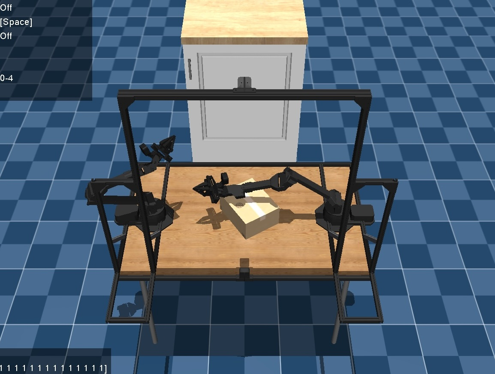
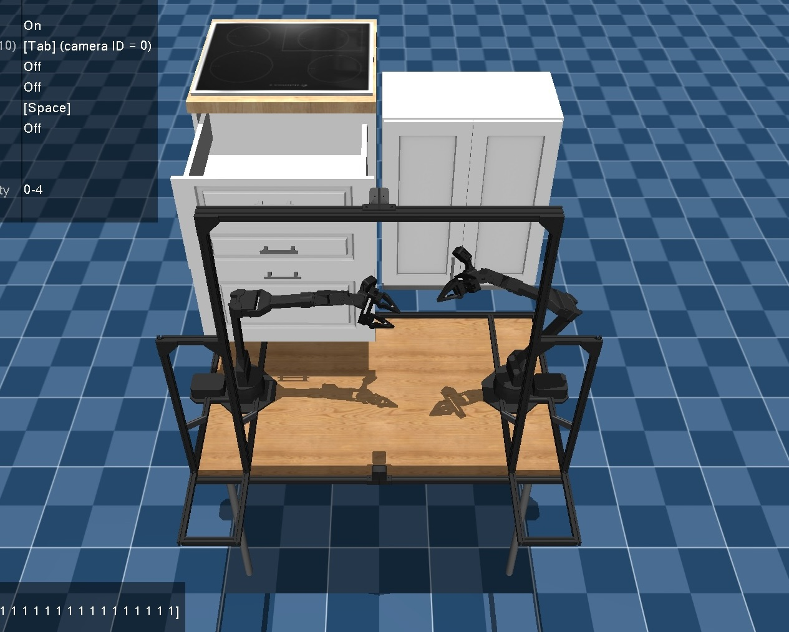
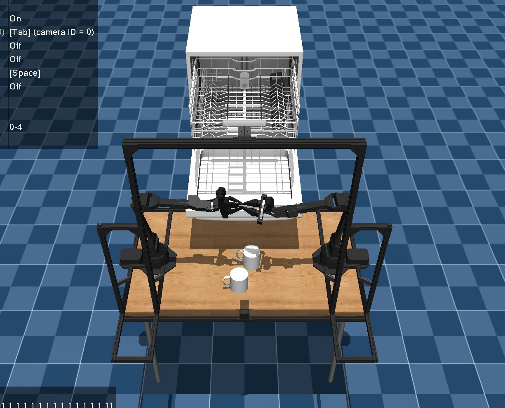
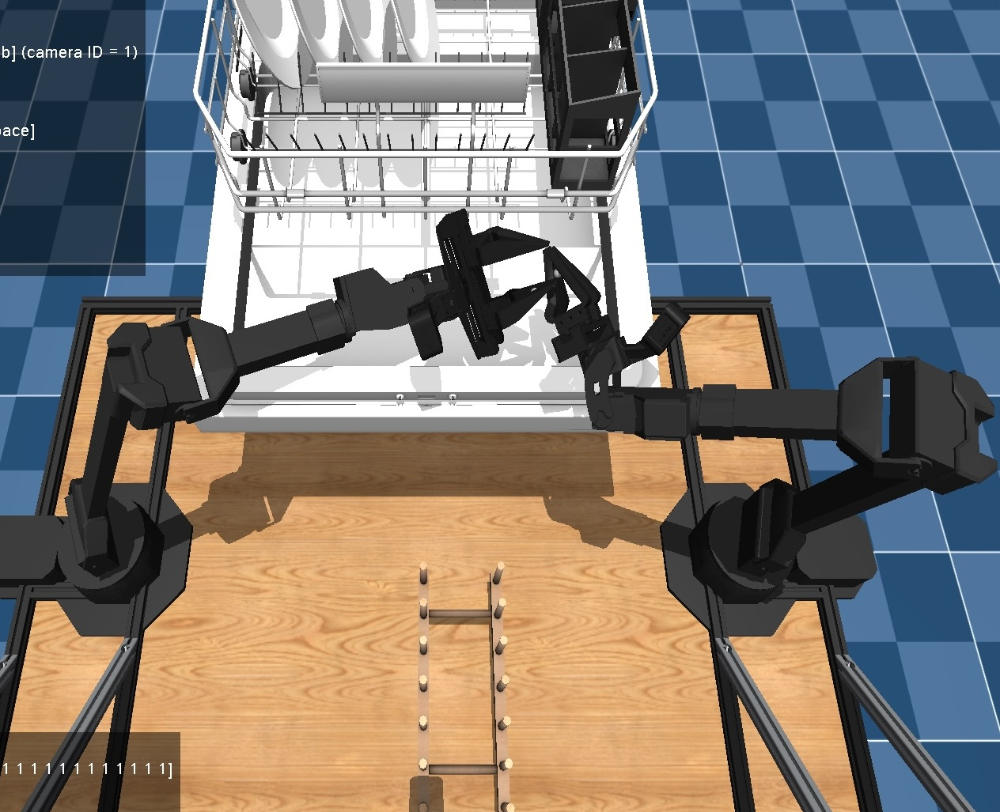
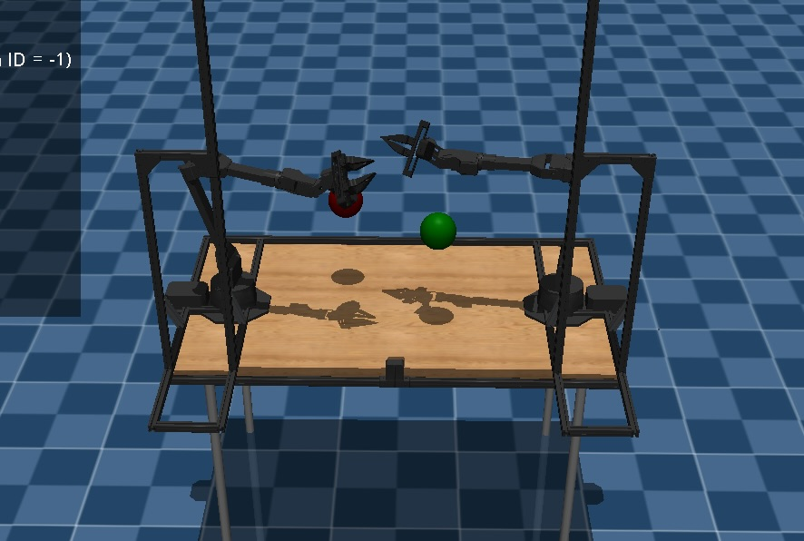
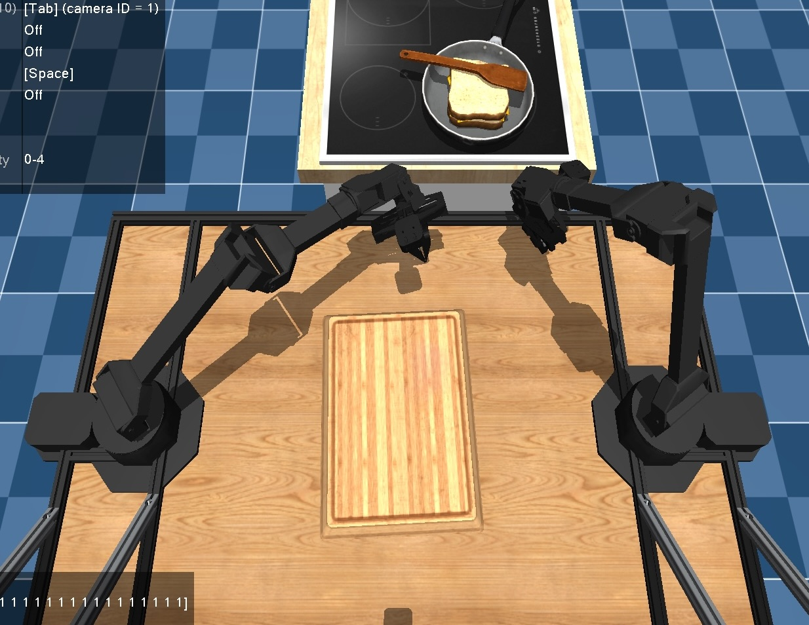
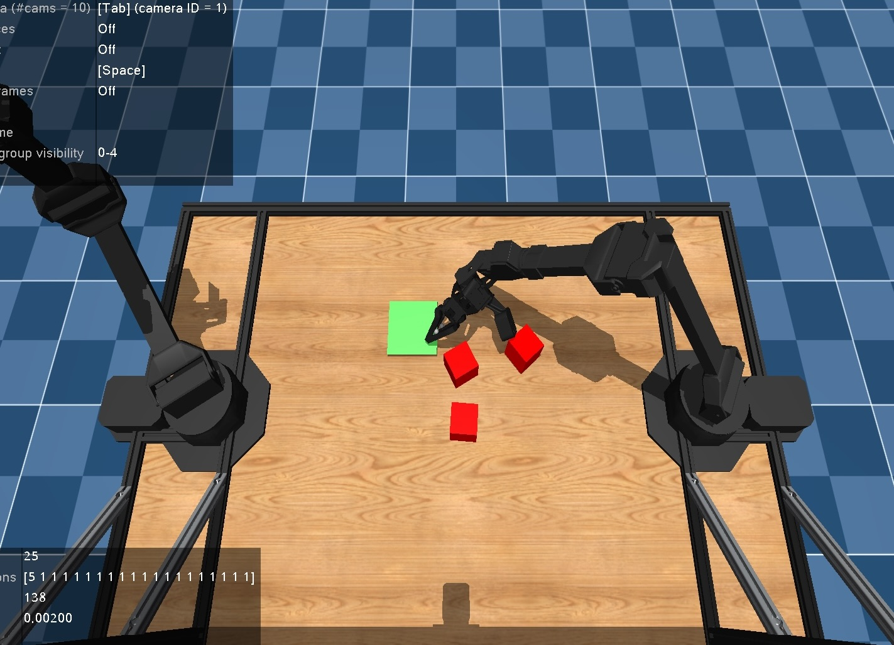

# Nintendo Teleoperation of Bimanual ALOHA

[](https://x.com/Almondgodd/status/1856891187665256939) 


This repository contains:
1. Nintendo Joycon Teleoperation of the Bimanual [ALOHA](https://aloha-2.github.io/) system in Mujoco simulator with 50 Bigym bimanual benchmark tasks
2. Training Infrastructure for an Action-Chunking Transformer using teleoperation data
   
## Repository Contents:
[Control](./control) contains the Nintendo switch teleoperation script [teleop_aloha.py](./control/teleop_aloha.py), before running simply connect Joycons to your machine via Bluetooth and run the below Install instructions

[Bigym](./bigym) contains the modified Bigym benchmark environments including the bimanual ALOHA setup

[Models](./models) is a submodule of the forked AC repository. It contains the training script [imitate_episodes.py](./models/imitate_episodes.py) and the evaluation/inference script [model_eval.py](./control/model_eval.py). For training and inference instructions see the [repository README](https://github.com/AlmondGod/act-bigym-aloha/tree/742c753c0d4a5d87076c8f69e5628c79a8cc5488).

## Installation

```bash
git clone https://github.com/AlmondGod/aloha-bigym/tree/master
cd aloha-bigym
python3.12 -m venv .venv
source .venv/bin/activate
pip install .
git submodule update --init --recursive
```

- If you encounter this error: `ImportError: cannot import name 'MujocoElement' from 'mojo.elements'`, add this line: 
`from mojo.elements.element import MujocoElement` 
to `.venv/lib/python3.12/site-packages/gymnasium/envs/mujoco/mujoco_rendering.py`

To run the simulated aloha bigym tasks navigate to [examples](examples) and run any of the `aloha_<task>.py` files.

Assets from [Mujoco Menagerie](https://github.com/google-deepmind/mujoco_menagerie/tree/main/aloha).

## Available Tasks:

[aloha_box.py](examples/aloha_box.py) contains `StoreBox` and `PickBox`
<div>
  
</div>

[aloha_cupboards.py](examples/aloha_cupboards.py) contains `WallCupboardOpen`, `WallCupboardClose`, `DrawerTopOpen`, `DrawerTopClose`, `DrawersAllOpen`, `DrawersAllClose`
<div>
  
</div>

[aloha_dishwasher.py](examples/aloha_dishwasher.py) contains `DishwasherOpen`, `DishwasherClose`, `DishwasherOpenTrays`, `DishwasherCloseTrays`

[aloha_dishwasher_cups.py](examples/aloha_dishwasher_cups.py) contains `DishwasherUnloadCups`, `DishwasherLoadCups`, `DishwasherUnloadCupsLong`
<div>
  
</div>

[aloha_dishwasherplates.py](examples/aloha_dishwasherplates.py) contains `DishwasherUnloadPlates`, `DishwasherLoadPlates`, `DishwasherUnloadPlatesLong`
<div>
  
</div>

[aloha_dishwashercutlery.py](examples/aloha_dishwashercutlery.py) contains `DishwasherUnloadCutlery`, `DishwasherLoadCutlery`, `DishwasherUnloadCutleryLong`

[aloha_dualreachtar.py](examples/aloha_dualreachtar.py) contains `ReachTargetDual`, `ReachTarget`, `ReachTargetSingle`
<div>
  
</div>

[aloha_flip.py](examples/aloha_flip.py) contains `FlipCup`, `FlipCutlery`

[aloha_groceries.py](examples/aloha_groceries.py) contains `GroceriesStore`
<div>
  
</div>

[aloha_moveplates.py](examples/aloha_moveplates.py) contains `MovePlate`, `MoveTwoPlates`

[aloha_saucepan.py](examples/aloha_saucepan.py) contains `FlipSandwich`, `ToastSandwich`, `SaucepanToHob`, `RemoveSandwich`
<div>
  
</div>

[aloha_stackblocks.py](examples/aloha_stackblocks.py) contains `StackBlocks` 
<div>
  
</div>

[aloha_storekitchenware.py](examples/aloha_storekitchenware.py) contains `StoreKitchenware`

[aloha_takecups.py](examples/aloha_takecups.py) contains `TakeCups`, `PutCups`

<div>
  
</div>

No longer relevant: `PickBox`, `GroceriesStoreLower`, `CupboardsOpenAll`, `CupboardsCloseAll`

## Bigym Licenses
- [BiGym License (Apache 2.0)](LICENSE) - This repository
- [Mujoco Menagerie (Apache 2.0)](https://github.com/google-deepmind/mujoco_menagerie/blob/main/LICENSE) - Models of robots and grippers
- [3D Assets Attributions (CC0, CC BY 4.0, CC BY NC 4.0)](bigym/envs/xmls/3D_MODELS_ATTRIBUTION.md) - 3D Assets

## Bigym Citation
```bibtex
@article{chernyadev2024bigym,
  title={BiGym: A Demo-Driven Mobile Bi-Manual Manipulation Benchmark},
  author={Chernyadev, Nikita and Backshall, Nicholas and Ma, Xiao and Lu, Yunfan and Seo, Younggyo and James, Stephen},
  journal={arXiv preprint arXiv:2407.07788},
  year={2024}
}
```
